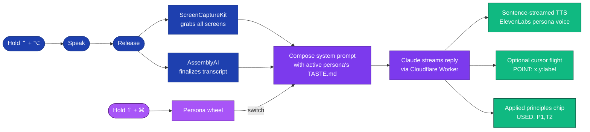
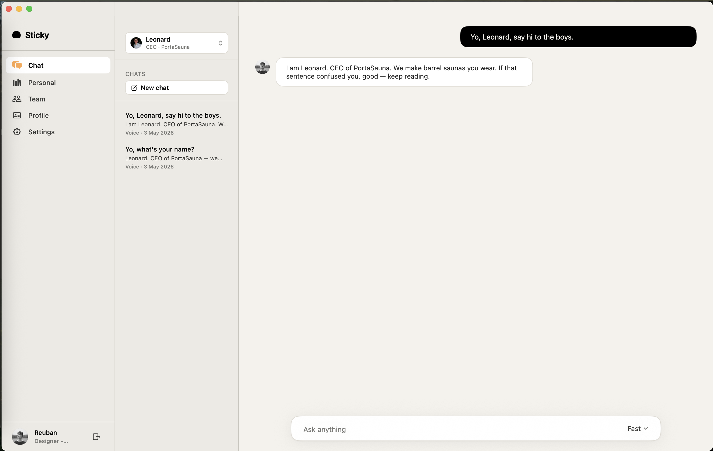

<div align="center">

# Sticky

**A macOS menu bar AI companion that wears your team's taste.**

[](#)
[](#)
[](#)
[](#)
[](#)

Hold a key, talk to your screen. Sticky answers in the voice and taste of whichever **persona** you're wearing — yourself, a teammate, or the team as a whole.

</div>

---

> [!NOTE]
> **The 30-second pitch.** Most AI tools forget you the moment the conversation ends. Sticky watches *how you make decisions* — what you keep, what you cut, what you reword — and turns that into durable, reusable taste. Switch personas with a flick of the wrist and the next answer comes back in their voice, grounded in their style.

---

## The main loop

Hold `⌃ + ⌥` anywhere on your Mac, speak, release. Sticky transcribes, screenshots, reasons, and replies in voice — all grounded in the active persona's taste.

<div align="center">


*The bottom-edge aurora glow is your live recording indicator — visible the entire time the mic is hot.*

</div>

---

## Personas, on a wheel

Hold `⇧ + ⌘` anywhere → a radial picker springs around your cursor. Move toward a spoke, release to commit. The next reply uses that persona's voice, soul, and TASTE.md.

<div align="center">


</div>

A persona switch wipes the rolling voice conversation history — switching mid-conversation feels like talking to a different person, because you are.

---

## Three things you actually do

### 1. Ask

Push to talk. Sticky sees your screen, hears your question, and answers in the active persona's voice. If the reply contains `[POINT:x,y:label]`, the blue cursor flies to that pixel on a bezier arc.

<div align="center">


</div>

### 2. Teach

Click **Start Teach Session**, work normally, narrate as you go. Sticky captures frames every 4s and runs continuous dictation. Click **Stop**, and Claude distills it into confident principles + ambiguous moments. Approve what you like, type your own for the fuzzy parts.

### 3. Browse

Everything Sticky has learned about you lives in the dashboard.

<div align="center">


*Memory tab — every approved principle, grouped by domain, Personal/Team toggle.*

<br /><br />


*Persona detail — soul paragraph + every principle that shapes how this persona thinks.*

</div>

---

## How it works



1. **Capture** — push-to-talk via `AVAudioEngine` + a system-wide listen-only `CGEvent` tap. Screenshot capture starts on key-*down* so it overlaps with you speaking.
2. **Transcribe** — AssemblyAI streams the transcript over a websocket; OpenAI and Apple Speech are fallbacks.
3. **Compose** — the active persona's `TASTE.md` (soul + principles) is folded into the system prompt with `[P1]` / `[T1]` short labels.
4. **Reason** — transcript + screenshots go to Claude through a Cloudflare Worker proxy. Claude (Haiku 4.5 by default — TTFT-bound) streams the reply.
5. **Speak** — sentences are dispatched to ElevenLabs *as they finalize*, so playback starts before generation finishes. The persona's voice ID is used automatically.
6. **Show your work** — Claude appends `[USED:P1,T2]` to flag which principles informed the answer; the chip shows them above the cursor.

---

## Conversations as windows

Sticky also opens as a real chat window when typing beats talking. Same persona, same voice, same taste — different surface.

<div align="center">



</div>

---

## Profiles & export

Each persona has an identity: display name, role, voice. Export the active persona's full taste as a single `TASTE.md` to share with a teammate — drop it into their `personas/` folder and they can wear it.

<div align="center">


<br /><br />


</div>

---

## API proxy

The app never calls external APIs directly. All requests go through a Cloudflare Worker (`worker/src/index.ts`) that holds the real keys as secrets.

| Route | Upstream | Purpose |
|-------|----------|---------|
| `POST /chat` | `api.anthropic.com/v1/messages` | Claude vision + streaming chat |
| `POST /tts` | `api.elevenlabs.io/v1/text-to-speech/{voiceId}` | ElevenLabs TTS audio |
| `POST /transcribe-token` | `streaming.assemblyai.com/v3/token` | Short-lived (480s) AssemblyAI websocket token |

Worker secrets: `ANTHROPIC_API_KEY`, `ASSEMBLYAI_API_KEY`, `ELEVENLABS_API_KEY`. Worker var: `ELEVENLABS_VOICE_ID`.

---

## Build & run

```bash
open leanring-buddy.xcodeproj
```

Select the `leanring-buddy` scheme, set your signing team, ⌘R.

> [!WARNING]
> Do **not** run `xcodebuild` from the terminal — it invalidates TCC permissions (Screen Recording, Accessibility, Microphone) and the app will need to re-request them.

<details>
<summary><b>Worker setup</b></summary>

```bash
cd worker
npm install

npx wrangler secret put ANTHROPIC_API_KEY
npx wrangler secret put ASSEMBLYAI_API_KEY
npx wrangler secret put ELEVENLABS_API_KEY

npx wrangler deploy
```

For local development create `worker/.dev.vars` with your keys and run `npx wrangler dev`.

</details>

---

## On-disk layout

```
~/Library/Application Support/com.learning-buddy.clicky/
  taste-profile.json                  ← user's personal taste (legacy JSON, still written)
  team-profile.json                   ← optional shared team taste
  team-context.json                   ← team brief + attached files metadata
  team-files/<filename>               ← attached files raw bytes
  personas/<id>/TASTE.md              ← per-persona override (hot-swap)
  personas/<id>/<avatar>.png|jpg      ← optional avatar override
```

Bundled defaults ship inside the app at `leanring-buddy/personas/<id>/TASTE.md`. Drop a new `<id>/TASTE.md` into Application Support and the wheel picks it up.

---

> [!IMPORTANT]
> ## Privacy
>
> - Voice capture only happens while `⌃ + ⌥` is held. The aurora glow on the cursor overlay is the recording indicator.
> - Teach sessions only capture frames between **Start** and **Stop**, with an elapsed timer the entire time.
> - Screenshots are sent to the Worker proxy in-memory and not retained on disk.
> - Nothing is added to a persona's `TASTE.md` until you tap **Remember** on the review card.
