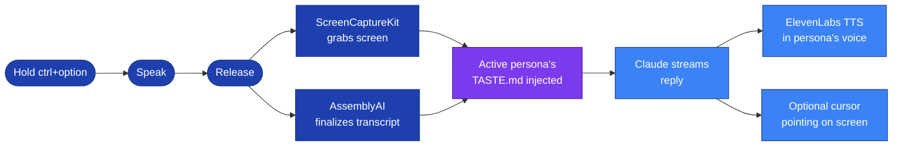

<div align="center">


# Sticky

**A macOS menu bar companion that wears your team's taste.**

[](#)
[](#)
[](#)
[](#)
[](#)

Hold a key, ask a question, and Sticky answers in the voice and taste of whichever teammate you're "wearing." Teach Sticky a new principle from your screen, and it folds into that persona's taste profile so the next answer reflects what they just learned.

<br />


</div>

---

> [!NOTE]
> **The 30-second pitch.** Most AI assistants flatten everyone into the same neutral voice. Sticky inverts that — each persona is a distinct teammate with their own voice, soul, and taste, and Sticky speaks as them. Teaching is the loop that keeps each persona's taste growing, so the assistant gets sharper at being *that specific person* over time.

<div align="center">

</div>

---

## Personas

A persona is a teammate Sticky can wear. Each one is a `personas/<id>/TASTE.md` file with a Soul section (voice, tone, what they care about) and a Taste section (principles with confidence + tags). Swap personas from the wheel picker in the menu bar — Sticky's avatar, voice, accent color, and the taste injected into the prompt all change at once.

<table>
<tr>
<td align="center" width="33%">

[](#)

Builder · ships the smallest thing that proves the idea.

</td>
<td align="center" width="33%">

[](#)

Engineer-designer · opinionated defaults over settings panes.

</td>
<td align="center" width="33%">

[](#)

Strategist · brand presence and clarity beat decoration.

</td>
</tr>
</table>

> [!TIP]
> The three above are seed personas baked into the build. Drop a new `personas/<id>/TASTE.md` (with `<!-- @persona id=… voice=… accent=… avatar=… -->` frontmatter) into Application Support and it appears in the wheel automatically.

---

## Ask — the main loop

<table>
<tr>
<td width="55%" valign="top">



</td>
<td width="45%" valign="top">

Push-to-talk via `AVAudioEngine` + a system-wide listen-only `CGEvent` tap. While you hold the key a waveform appears so you always know capture is live.

On release, ScreenCaptureKit grabs the active monitor and the active persona's `TASTE.md` is prepended to Claude's system prompt. The reply streams back as text and as TTS in the persona's voice. If Claude embeds a `[POINT:x,y:label:screenN]` tag, a blue cursor flies along a bezier arc to the target on the right monitor.

</td>
</tr>
</table>

---

## Teach — give the active persona context

<table>
<tr>
<td width="50%" valign="top">


Press **Start Teach Session** in the panel and work normally. Sticky captures frames at intervals while you narrate, drag, edit. Press **Stop** and Sticky reviews the timeline, distills it down, and surfaces a candidate principle in a review card.

**Remember** appends it to the active persona's `TASTE.md`. **Skip** discards it. Future Ask responses while wearing that persona reflect the new principle immediately — no app restart.

</td>
<td width="50%" valign="top">

```markdown
## Taste

### Design

- **Mood and motion matter — a tool should
  feel alive without showing off.**
  *(confidence 0.88 · motion, feel)*
  Cursor pulses, edge-glow breathes with
  voice level, persona wheel springs into
  place. Movement is on by default; static
  UI feels dead.
```

Stored as plain markdown — readable, grep-able, hand-editable. The frontmatter (`<!-- @persona id=… voice=… -->`) holds the persona's voice ID and accent color.

</td>
</tr>
</table>

---

## API proxy

The app never calls external APIs directly. All requests go through a Cloudflare Worker (`worker/src/index.ts`) that holds the real keys as secrets.

| Route | Upstream | Purpose |
|-------|----------|---------|
| `POST /chat` | `api.anthropic.com/v1/messages` | Claude vision + streaming chat |
| `POST /tts` | `api.elevenlabs.io/v1/text-to-speech/{voiceId}` | ElevenLabs TTS audio |
| `POST /transcribe-token` | `streaming.assemblyai.com/v3/token` | Short-lived (480s) AssemblyAI websocket token |

Worker secrets: `ANTHROPIC_API_KEY`, `ASSEMBLYAI_API_KEY`, `ELEVENLABS_API_KEY`.

---

## Build & run

```bash
open leanring-buddy.xcodeproj
```

Select the `leanring-buddy` scheme, set your signing team, ⌘R.

> [!WARNING]
> Do **not** run `xcodebuild` from the terminal — it invalidates TCC permissions (Screen Recording, Accessibility, Microphone) and the app will need to re-request them.

<details>
<summary><b>Worker setup</b></summary>

```bash
cd worker
npm install

npx wrangler secret put ANTHROPIC_API_KEY
npx wrangler secret put ASSEMBLYAI_API_KEY
npx wrangler secret put ELEVENLABS_API_KEY

npx wrangler deploy
```

For local development create `worker/.dev.vars` with your keys and run `npx wrangler dev`.

</details>

---

## Project layout

```
leanring-buddy/                  ← macOS app source
  CompanionManager.swift         ← central state machine (voice + teach session)
  CompanionPanelView.swift       ← menu bar panel with persona picker + teach button
  PersonaStore.swift             ← loads personas from TASTE.md files
  TeachSessionResultCard.swift   ← Remember/Skip card after a teach session
  OverlayWindow.swift            ← transparent full-screen overlay (cursor, waveform, text)
  BuddyDictationManager.swift    ← push-to-talk + transcription pipeline
  ClaudeAPI.swift                ← Claude vision + streaming client
  ElevenLabsTTSClient.swift      ← TTS playback
  DesignSystem.swift             ← DS.Colors / DS.CornerRadius / DS.Spacing tokens
  personas/                      ← seed personas (TASTE.md per teammate)
    reuban/TASTE.md
    leonard/TASTE.md
    magdalena/TASTE.md
worker/                          ← Cloudflare Worker proxy
```

---

> [!IMPORTANT]
> ## Privacy
>
> - Voice capture only happens while you're actively holding ctrl+option. The waveform indicator is visible the entire time.
> - Teach sessions only capture frames between Start and Stop, and the panel shows an elapsed timer the entire time.
> - Screenshots are sent to the Worker proxy in-memory and not retained on disk.
> - Nothing is added to a persona's `TASTE.md` until you tap **Remember** on the review card.
