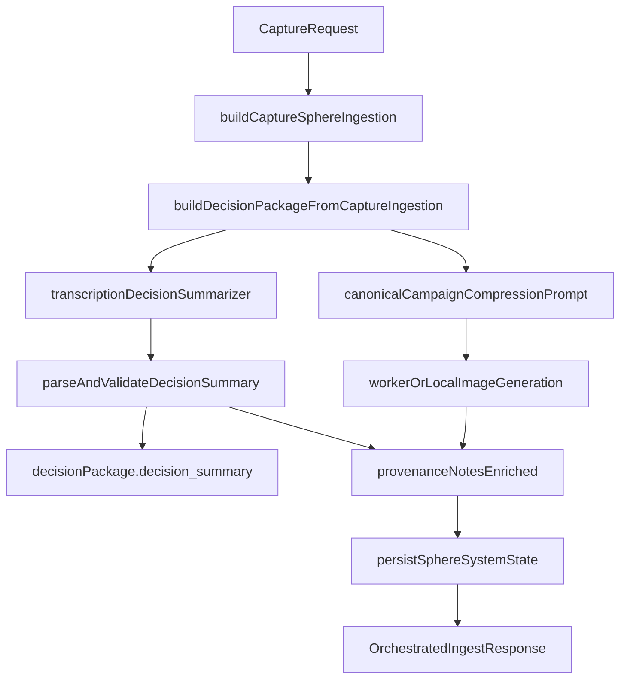

# Orchestrated Decision Package System

## Why this exists

This document defines the canonical orchestration contract for turning a single observed design decision into a persisted `DesignDecisionPackage` with:

- one transcription-to-decision summary agent
- one deterministic campaign-compression sphere image prompt

It is built to guarantee that each persisted package stays auditable:

- transcript evidence
- screenshot evidence metadata
- source context
- resulting sphere graph links
- lifecycle/provenance notes

## Canonical endpoint

- `POST /api/captures/ingest/orchestrated`
- Runtime: local Taste Engine (`taste-fingerprint-studio`)
- Strategy: `local_orchestrator`

## Request contract

The request extends `CaptureIngestRequest` with optional orchestration controls.

```json
{
  "capture": {
    "kind": "voice",
    "trigger": "push_to_talk",
    "transcript": "The hero spacing feels too dense.",
    "screenshot_data_url": "data:image/jpeg;base64,...",
    "metadata": {
      "screen_index": 0,
      "screenshot_width": 1728,
      "screenshot_height": 1117
    }
  },
  "design_context": {
    "target_name": "Homepage hero",
    "surface": "macOS screen",
    "intent": "improve visual hierarchy"
  },
  "dry_run": false,
  "orchestration": {
    "model": "claude-sonnet-4-20250514",
    "temperature": 0.2,
    "max_tokens": 1200
  }
}
```

## Agent Roles

The orchestrator calls Claude through the Worker proxy (`CLAUDE_WORKER_BASE_URL + /chat`) for one role:

1. `transcription_decision_summarizer`
  - Produces one precise decision summary from transcript + evidence context.
  - Its structured `decision_summary` replaces the heuristic package summary when valid.

The campaign-compression image step is not another Claude agent. It always uses the canonical fixed Campaign Compression Sphere prompt, with the source screenshot passed as image input when present. This keeps image generation deterministic and grounded in the screenshot instead of allowing a prompt-writing agent to drift.

## Output contract

Response includes standard capture-ingest artifacts plus orchestration metadata:

- `capture`
- `weighted_objects`
- `sphere`
- `associations_created`
- `follow_up_question`
- `observation_session_id`
- `decision_package`
- `orchestration.version`
- `orchestration.strategy`
- `orchestration.agent_audits[]`
- `orchestration.campaign_compression_sphere.prompt`
- `orchestration.campaign_compression_sphere.source_image_attached`

## Summary Agent Prompt

The summary agent uses this system prompt:

```text
You are the transcription_decision_summarizer for an inspectable design-taste memory system.

Your job is to convert one design decision package into a precise Design Decision Summary that can be reused later in deployment mode.

Rules:
- Use only evidence present in the package context.
- Do not invent visual facts that are not supported by transcript, screenshot evidence metadata, source context, weighted objects, or the draft sphere.
- Separate observed decisions from inferred taste.
- Prefer concrete reusable design judgment over generic design advice.
- Capture what was accepted, overweighted, underweighted, rejected, or invented.
- If transcript or screenshot evidence is missing, mark it in missing_evidence and lifecycle_readiness.blocking_reasons.
- Draft inferred taste must never be described as approved truth.
- Avoid weak labels like "good design", "modern", "nice", or "clean" unless the transcript explicitly uses them and the reusable rule makes them concrete.
- Return JSON only. No markdown. No prose outside the JSON object.
```

It must return:

```json
{
  "decision_summary": {
    "central_decision": "One sentence describing the actual design decision.",
    "reusable_rule": "One portable rule that another designer can apply later.",
    "accepted": [{ "label": "string", "rationale": "why this was chosen or overweighted" }],
    "rejected": [{ "label": "string", "rationale": "why this was rejected or suppressed" }],
    "underweighted": [{ "label": "string", "rationale": "why this should stay present but reduced" }],
    "invented": [{ "label": "string", "rationale": "what new taste object or concept was created" }],
    "use_when": ["specific contexts where this rule applies"],
    "avoid_when": ["specific contexts where this rule should not be applied"],
    "deployment_prompt": "A concise instruction Clicky can use in deployment mode."
  },
  "evidence_notes": {
    "transcript_basis": ["short exact phrases from the transcript"],
    "screenshot_basis": "what screenshot evidence exists or is missing",
    "source_context_basis": ["specific context fields used"]
  },
  "lifecycle_readiness": {
    "status": "incomplete | draft_ready | review_ready",
    "blocking_reasons": ["why this cannot be trusted yet"]
  },
  "missing_evidence": ["missing transcript, screenshot, source context, graph links, or lifecycle status"]
}
```

## Data flow




## Environment

Required for orchestration:

- `CLAUDE_WORKER_BASE_URL`
  - Example: `https://your-worker.workers.dev`
- Optional: `CLAUDE_ORCHESTRATOR_MODEL`
  - Default: `claude-sonnet-4-20250514`

Optional for image generation:

- `IMAGE_WORKER_BASE_URL`
  - Uses a Worker `/image` route when set.
- `OPENAI_API_KEY`
  - Local server-side fallback for image generation. This is useful when Claude calls should still use `CLAUDE_WORKER_BASE_URL`, but the deployed Worker does not yet expose `/image`.
- `OPENAI_IMAGE_MODEL`
  - Default: `gpt-image-1`

Image generation precedence:

1. `IMAGE_WORKER_BASE_URL + /image`
2. Local `OPENAI_API_KEY`
3. `CLAUDE_WORKER_BASE_URL + /image`

## Guardrails

- Screenshot payloads are sanitized from persisted raw capture bodies.
- Screenshot evidence is persisted as metadata (`mime`, `byte_length`, `sha256`, dimensions) in `decision_package.screenshot_evidence`.
- `dry_run: true` executes orchestration and returns an auditable package preview without mutating local JSON storage.

## Implementation references

- `taste-fingerprint-studio/app/api/captures/ingest/orchestrated/route.ts`
- `taste-fingerprint-studio/lib/orchestration/decision-package-orchestrator.ts`
- `taste-fingerprint-studio/lib/orchestration/claude-client.ts`
- `taste-fingerprint-studio/lib/captures/agent.ts`
- `taste-fingerprint-studio/lib/decision-packages/package-builder.ts`
